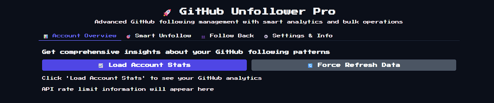
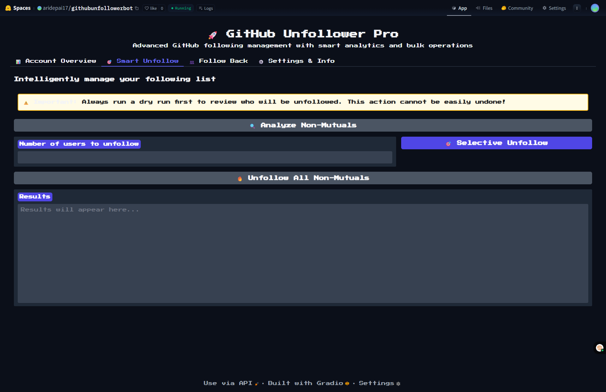
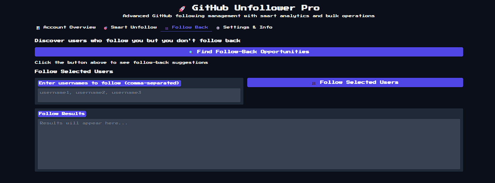
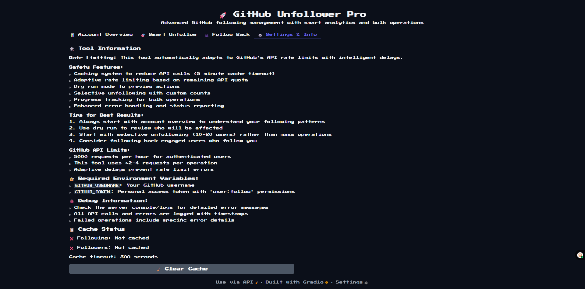

# 🚀 GitHub Unfollower Pro

> **⚠️ IMPORTANT:**
> 
> Your GitHub Personal Access Token **MUST** have the `user:follow` scope enabled for unfollow/follow actions to work. If you do not check this scope when creating your token, the tool will not be able to unfollow or follow users, and you may see 404 errors from the API. See the [GitHub Token Configuration](#-github-token-configuration) section below for details.

A powerful, professional web application for intelligent GitHub following management. Built with advanced analytics, safety features, and a modern UI to help you optimize your GitHub networking strategy.

## 🖼️ Screenshots

Get a preview of the GitHub Unfollower Pro interface:

**Account Overview Tab**


**Smart Unfollow Tab**


**Follow Back Tab**


**Settings & Info Tab**



> _The UI is designed for clarity and accessibility in both light and dark themes._

## 🚀 Live Demo

Try GitHub Unfollower Pro instantly on Hugging Face Spaces:

👉 [Launch the App on Hugging Face](https://huggingface.co/spaces/aridepai17/githubunfollowerbot)

## ✨ Key Features

### 📊 **Smart Analytics Dashboard**
- **Comprehensive account overview** with detailed statistics
- **Follow-back ratio analysis** and engagement metrics
- **Mutual connection insights** and networking recommendations
- **Profile integration** with bio, repositories, and user info

### 🎯 **Intelligent Unfollow System**
- **Selective unfollowing** - choose exactly how many users to unfollow
- **Advanced dry run analysis** with detailed user insights
- **Progress tracking** with real-time status updates
- **Safety confirmations** and warning systems

### 👥 **Strategic Follow-Back Suggestions**
- **Discover potential connections** who already follow you
- **Build mutual relationships** for better engagement
- **Smart recommendations** based on your networking patterns

### 🛡️ **Enterprise-Grade Safety**
- **Rate limiting protection** with automatic API management
- **Comprehensive error handling** and status reporting
- **Batch operation controls** to prevent API abuse
- **Detailed logging** of all actions and results

## 🚀 Tech Stack

### **Backend Architecture**
- **Python 3.8+** - Core application logic
- **Requests Library** - HTTP client for GitHub API interactions
- **GitHub REST API v3** - Official GitHub API integration
- **Time Management** - Built-in rate limiting and delay systems

### **Frontend & UI Framework**
- **Gradio 4.0+** - Modern Python web framework
- **Custom CSS** - Professional styling with gradients and animations
- **Responsive Design** - Optimized for desktop and mobile
- **Tabbed Interface** - Organized user experience

### **Advanced Features**
- **Pagination Handling** - Automatic management of large datasets
- **Error Recovery** - Robust exception handling and user feedback
- **Progress Tracking** - Real-time operation status updates
- **Data Visualization** - Statistical insights and analytics

### **Deployment Platform**
- **Hugging Face Spaces** - Professional cloud hosting
- **Environment Security** - Secure credential management
- **Auto-scaling** - Handles multiple concurrent users

## 🛠️ Installation & Setup

### **Prerequisites**
- Python 3.8 or higher
- GitHub Personal Access Token with `user:follow` permissions
- Git for version control

### **Local Development Setup**

1. **Clone the repository**
   ```bash
   git clone https://github.com/yourusername/github-unfollower-pro.git
   cd github-unfollower-pro
   ```

2. **Create virtual environment**
   ```bash
   python -m venv venv
   source venv/bin/activate  # On Windows: venv\Scripts\activate
   ```

3. **Install dependencies**
   ```bash
   pip install -r requirements.txt
   ```

4. **Configure environment variables**
   ```bash
   # Create .env file
   echo "GITHUB_USERNAME=your_github_username" > .env
   echo "GITHUB_TOKEN=your_personal_access_token" >> .env
   ```

5. **Launch the application**
   ```bash
   python app.py
   ```

6. **Access the interface**
   Navigate to `http://localhost:7860` in your browser

### **Dependencies (requirements.txt)**
```
gradio>=4.0.0
requests>=2.28.0
python-dotenv>=0.19.0
```

## 🤗 Hugging Face Spaces Deployment

### **🌐 Live Demo**
**Access the tool**: [GitHub Unfollower Pro on Hugging Face](https://huggingface.co/spaces/YOUR_USERNAME/github-unfollower-pro)

### **Deploy Your Own Instance**

1. **Prepare your repository**
   ```bash
   # Ensure you have these files:
   # - app.py (main application)
   # - requirements.txt (dependencies)
   # - README.md (documentation)
   ```

2. **Create Hugging Face Space**
   - Visit [Hugging Face Spaces](https://huggingface.co/new-space)
   - Choose **"Gradio"** as SDK
   - Set visibility to **Public** or **Private**
   - Connect your GitHub repository

3. **Configure Space Settings**
   ```bash
   # In Space settings, add these secrets:
   GITHUB_USERNAME=your_github_username
   GITHUB_TOKEN=ghp_your_token_here
   ```

4. **Automatic Deployment**
   - Hugging Face automatically builds and deploys
   - Monitor build logs for any issues
   - Access via your custom Space URL

## 🔑 GitHub Token Configuration

### **Creating Your Personal Access Token**

1. **Navigate to GitHub Settings**
   - Go to [GitHub Settings > Developer Settings > Personal Access Tokens](https://github.com/settings/tokens)

2. **Generate New Token (Classic)**
   - Click "Generate new token (classic)"
   - Set expiration (recommend 90 days for security)

3. **Required Scopes**
   ```
   ✅ user:follow     - Follow/unfollow users (REQUIRED)
   ✅ read:user       - Read user profile information
   ✅ user:email      - Access user email (optional)
   ```
   > **Note:** If you do not check `user:follow`, the tool will not be able to unfollow or follow users, and you will see 404 errors from the API.

4. **Secure Token Storage**
   - Copy token immediately (it won't be shown again)
   - Store securely in environment variables
   - Never commit tokens to version control

## 📱 User Guide

### **🎯 Getting Started**

1. **Account Overview**
   - Click "📈 Load Account Stats" to analyze your account
   - Review your following patterns and recommendations
   - Understand your networking metrics

2. **Smart Analysis**
   - Use "🔍 Analyze Non-Mutuals" for detailed insights
   - Review the list of users who don't follow back
   - Check recommendations before taking action

3. **Selective Unfollowing** ⭐ **Recommended**
   - Set number of users to unfollow (start with 10-20)
   - Click "🎯 Selective Unfollow" for controlled cleanup
   - Monitor results and adjust strategy

4. **Follow-Back Opportunities**
   - Discover users who follow you but you don't follow back
   - Build mutual connections strategically
   - Improve your engagement and networking

### **🛡️ Best Practices**

- **Start Small**: Begin with 10-20 unfollows to test the system
- **Regular Maintenance**: Use weekly for optimal results
- **Check Analytics**: Monitor your follow-back ratio regularly
- **Strategic Following**: Focus on building mutual connections
- **Respect Rate Limits**: The tool handles this automatically

## ⚙️ Advanced Configuration

### **Rate Limiting Settings**
```python
# Built-in rate limiting (automatically handled)
REQUESTS_PER_HOUR = 5000  # GitHub API limit
DELAY_BETWEEN_REQUESTS = 0.5  # seconds
MAX_BATCH_SIZE = 100  # users per operation
```

### **Custom Styling**
The application includes custom CSS for professional appearance:
- Gradient backgrounds and modern design
- Responsive layout for all devices
- Professional color scheme and typography
- Interactive elements with hover effects

## 🔒 Security & Privacy

### **Data Protection**
- **No data storage**: All operations are real-time via GitHub API
- **Secure authentication**: Token-based GitHub API access
- **Environment isolation**: Credentials stored securely
- **No logging**: Personal information never stored locally

### **API Security**
- **Rate limit compliance**: Automatic throttling and delays
- **Error handling**: Comprehensive exception management
- **Token validation**: Automatic credential verification
- **Secure headers**: Proper API authentication

## 📊 Analytics & Insights

### **Metrics Tracked**
- Total following vs followers count
- Mutual connection percentage
- Non-mutual following analysis
- Follow-back opportunity identification
- Account growth recommendations

### **Reporting Features**
- Real-time statistics dashboard
- Progress tracking for bulk operations
- Success/failure rate monitoring
- Detailed operation logs

## 🤝 Contributing

We welcome contributions to improve GitHub Unfollower Pro!

### **Development Setup**
```bash
git clone https://github.com/yourusername/github-unfollower-pro.git
cd github-unfollower-pro
python -m venv venv
source venv/bin/activate
pip install -r requirements.txt
pip install -r requirements-dev.txt  # Development dependencies
```

### **Contribution Guidelines**
- Fork the repository and create feature branches
- Follow PEP 8 Python style guidelines
- Add tests for new functionality
- Update documentation for changes
- Submit pull requests with detailed descriptions

## 🚨 Important Limitations

### **GitHub API Restrictions**
- **5,000 requests per hour** for authenticated users
- **Rate limiting** automatically enforced by the tool
- **Token permissions** must include `user:follow` scope

### **Recommended Usage**
- **Daily operations**: Limit to 100-200 unfollows per day
- **Bulk operations**: Use selective unfollowing for large lists
- **API conservation**: Avoid unnecessary repeated analyses

## 🆘 Troubleshooting

### **Common Issues**

**❌ "API rate limit exceeded"**
```
Solution: Wait 1 hour or use selective unfollowing with smaller batches
```

**❌ "Authentication failed"**
```
Solution: Verify your GitHub token has correct permissions and hasn't expired
```

**❌ "User not found"**
```
Solution: Some users may have been deleted or changed usernames
```

**❌ "Connection timeout"**
```
Solution: Check internet connection and GitHub API status
```

## 📄 License

This project is licensed under the **MIT License** - see the [LICENSE](LICENSE) file for details.

## 🙏 Acknowledgments

- **GitHub API Team** - For comprehensive user management capabilities
- **Gradio Framework** - For the powerful web interface framework
- **Hugging Face** - For providing free, professional hosting platform
- **Python Community** - For excellent libraries and tools
- **Open Source Contributors** - For inspiration and best practices

## 📞 Support & Contact

### **Getting Help**
- 📚 **Documentation**: Check this README for comprehensive guidance
- 🐛 **Bug Reports**: Open an issue on GitHub with detailed information
- 💡 **Feature Requests**: Submit enhancement ideas via GitHub Issues
- 🔧 **Technical Support**: Check GitHub API documentation and Gradio docs

### **Useful Resources**
- [GitHub API Documentation](https://docs.github.com/en/rest)
- [Gradio Documentation](https://gradio.app/docs/)
- [Hugging Face Spaces Guide](https://huggingface.co/docs/hub/spaces)
- [Python Requests Documentation](https://requests.readthedocs.io/)

---

<div align="center">

**⭐ Star this repository if GitHub Unfollower Pro helped optimize your networking!**

*Built with ❤️ for the GitHub community*

</div>

## 🆕 Accessibility & UI Improvements

- The warning box for critical actions (like unfollow) is now styled for **high visibility** in both light and dark themes, using a high-contrast yellow background and dark text.
- All important warnings and confirmations are easy to read regardless of your system or browser theme.

## ⚠️ Username Handling

- **Usernames are now case-sensitive for API calls.**
- The tool uses the exact username as returned by the GitHub API when performing follow/unfollow actions.
- If you see 404 errors for users you are sure you are following, double-check your token scope and that the username matches exactly (including case).

## 🧑‍💻 Troubleshooting & FAQ

### **Q: I get 404 errors when trying to unfollow users I am following.**
- **A:** Make sure your GitHub token has the `user:follow` scope enabled. This is required for follow/unfollow actions. Also, ensure you are using the exact username as returned by the API (case-sensitive).

### **Q: I don't see the "Follow" button after unfollowing someone.**
- **A:** GitHub's UI may cache your follow status for a few minutes. Try refreshing the page, using an incognito window, or waiting a few minutes. If you or the other user has blocked each other, the button will not appear.

### **Q: The warning box is hard to read in dark mode.**
- **A:** The UI now uses a high-contrast yellow background and dark text for all warnings, making them visible in both light and dark themes.

### **Q: Why do I see only "Block or Report" on a user's profile?**
- **A:** This means you are not following the user, and either you have blocked them, they have blocked you, or GitHub's UI is still updating. Check your block list and try again later.

### **Q: How can I confirm if a user was unfollowed?**
- **A:** Check your following list on GitHub (https://github.com/your-username?tab=following) and search for the username. If they do not appear, you are not following them.

---